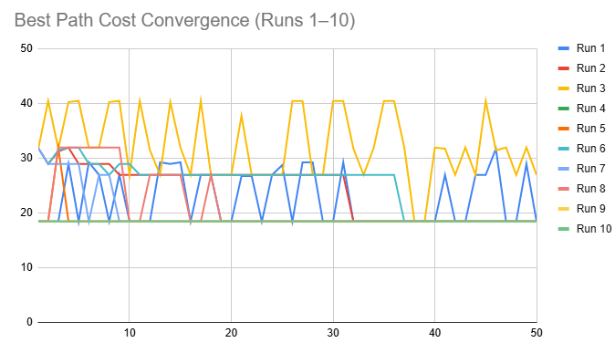
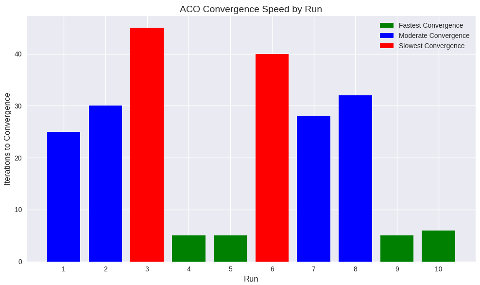
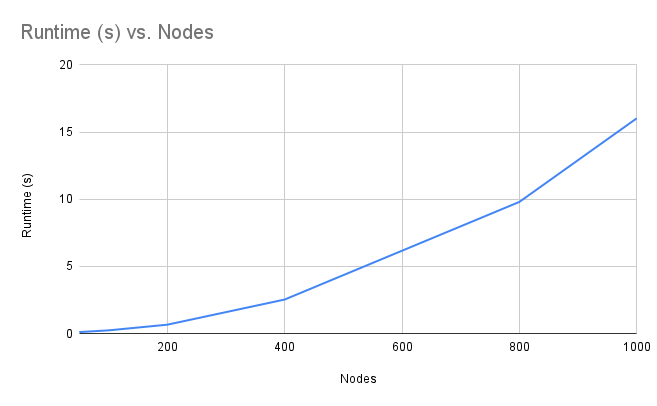
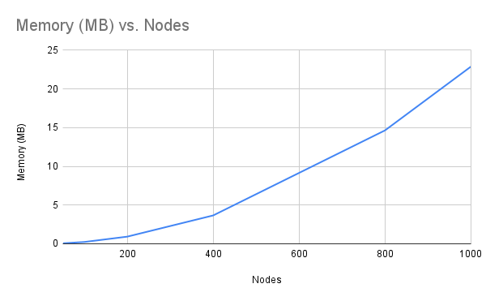
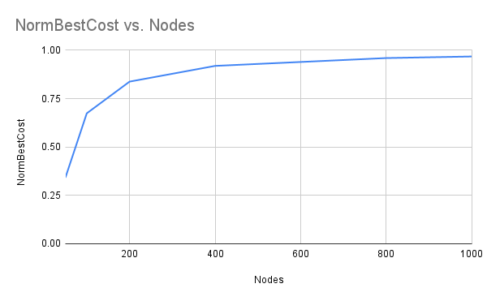

[](https://classroom.github.com/a/zBqi0PeJ)
# Research Paper
* Name: Emily Despres
* Semester: Fall 2026
* Topic: Ant Colony Optimization (ACO)


Note the following is an example outline to help you. Please rework as you need, you do not need to follow the section heads and *YOU SHOULD NOT* make everything a bulleted list. This needs to read as an executive report/research paper. 

## Introduction

Ant Colony Optimization (ACO) is an algorithm inspired by the cooperative behavior of ants in nature. When ants search for food, they explore their environment and leave behind pheromone trails. These chemical signals act as a form of indirect communication, guiding other ants toward promising paths. Over time, trails along shorter or more efficient routes become stronger as more ants reinforce them, while less effective paths fade away. This simple biological process allows an ant colony, without any central control, to collectively discover near optimal solutions to complex problems such as finding the shortest path between their nest and a food source. ACO takes this idea and translates it into a computational model, where artificial “ants” explore graphs and update pheromone levels to gradually converge on good solutions. [1][2]

The algorithm was first introduced in the early 1990s by Marco Dorigo as part of his doctoral research. His initial version, called the Ant System (AS), laid the foundation for later refinements such as the Ant Colony System (ACS) and the MAX–MIN Ant System (MMAS), each designed to improve efficiency and avoid premature convergence.[5] Since its introduction, ACO has grown into a family of related algorithms widely applied to NP‑hard problems like the Traveling Salesman Problem, vehicle routing, and scheduling. Instead of guaranteeing the absolute best answer, ACO uses probability and feedback to find solutions that are close to optimal in a reasonable amount of time. This report examines how the algorithm works, and analyzes its complexity. By looking at both the strengths and challenges of ACO, the report shows how biologically inspired computing continues to provide creative strategies for solving difficult problems. [1][2][4]


## Analysis of Algorithm/Datastructure
Time Complexity:

The runtime of Ant Colony Optimization depends on how many ants are used, how many iterations the algorithm runs, and the size of the graph. Each ant constructs a solution by exploring nodes and updating pheromone trails. For a graph with $n$ nodes, this process can take up to $O(n^2)$ steps in a single iteration, since ants may evaluate many possible edges.[2][4]

Space Complexity:

Ant Colony Optimization requires memory to store pheromone values and track the paths taken by ants. The largest part of this storage comes from the pheromone matrix, which keeps a value for every edge in the graph. In a fully connected graph with $n$ nodes, there are $O(n^2)$ edges, so the pheromone matrix alone requires $O(n^2)$ space. Each ant also maintains a record of the nodes it has visited (often called a tabu list) and the cost of its current path. This adds about $O(n)$ space per ant, but compared to the pheromone matrix, this is relatively small. Overall, the space complexity of ACO is dominated by the pheromone storage, giving a total of $O(n^2)$.[1][2]

| Scenario                | Time Complexity      | Space Complexity |
| :--                     | :--                  | :--              |
| One ant, one iteration  | $O(n^2)$             | $O(n^2)$         |
| $k$ ants, one iteration | $O(k \cdot n^2)$     | $O(n^2)$         |
| $k$ ants, $t$ iterations| $O(t \cdot k \cdot n^2)$ | $O(n^2)$     |
| Simplified reporting    | $O(k \cdot n^2)$     | $O(n^2)$         |

General analysis of the algorithm/datastructure:

ACO is a probabilistic search algorithm designed for complex optimization problems. Instead of guaranteeing exact optimality like deterministic algorithms such as Dijkstra’s, it relies on iterative exploration and reinforcement to find near optimal solutions. Its main strengths are adaptability to changing environments, the ability to run many ants at once, and robustness in large search spaces. ACO has been successfully applied to problems like the Traveling Salesman Problem, scheduling, and routing, where exact methods are impractical. At the same time, ACO has weaknesses. It converges more slowly than deterministic algorithms, requires careful parameter tuning, and can reinforce suboptimal paths if exploration is limited. Memory usage is also significant, since the pheromone matrix requires $O(n^2)$ space in dense graphs. Overall, ACO is not the fastest or most memory efficient method, but it is flexible and effective for NP‑hard problems where approximate solutions are acceptable.[2][5]


## Empirical Analysis

To evaluate the performance of Ant Colony Optimization (ACO), I conducted experiments varying the algorithm’s parameters: pheromone influence (α), heuristic influence (β), evaporation rate (ρ), and deposit amount (Q). Each run produced a convergence log in CSV format, recording both the best solution found in each iteration and the overall global best solution. At the end of each run, a “Final” row was appended to summarize the colony’s global best path length, cost, normalized cost, and improvement factor.

The normalized cost was calculated by dividing the best path cost by a baseline “chain” path cost, defined as $1.1 \cdot (𝑛 − 1)$ for a graph of $𝑛$
nodes. This provides a scale free measure of efficiency, allowing comparisons across different graph sizes. The improvement factor was computed as the ratio of the baseline cost to the best path cost, showing how much better the colony’s solution was compared to the trivial chain.

# ACO Parameter Comparison

| Run | α (Alpha) | β (Beta) | ρ (Evaporation) | Q (Deposit) | GlobalBestLength | GlobalBestCost | NormBestCost | ImprovementFactor |
|-----|-----------|----------|-----------------|-------------|------------------|----------------|--------------|-------------------|
| 1   | 1.0       | 0.5      | 0.1             | 1.0         | 13               | 18.40          | 0.3414       | 2.9293            |
| 2   | 1.0       | 3.0      | 0.5             | 10.0        | 13               | 18.40          | 0.3414       | 2.9293            |
| 3   | 0.5       | 4.0      | 0.6             | 10.0        | 13               | 18.40          | 0.3414       | 2.9293            |
| 4   | 2.0       | 2.0      | 0.4             | 10.0        | 13               | 18.40          | 0.3414       | 2.9293            |
| 5   | 1.0       | 2.0      | 0.5             | 1.0         | 13               | 18.40          | 0.3414       | 2.9293            |
| 6   | 1.0       | 3.0      | 0.3             | 10.0        | 13               | 18.40          | 0.3414       | 2.9293            |
| 7   | 1.0       | 3.0      | 0.6             | 10.0        | 13               | 18.40          | 0.3414       | 2.9293            |
| 8   | 0.5       | 3.0      | 0.4             | 10.0        | 13               | 18.40          | 0.3414       | 2.9293            |
| 9   | 2.0       | 1.0      | 0.5             | 10.0        | 13               | 18.40          | 0.3414       | 2.9293            |
| 10  | 1.5       | 3.0      | 0.4             | 10.0        | 13               | 18.40          | 0.3414       | 2.9293            |

Each run in the experiment used different parameter settings, which shaped how the ant colony explored the graph. Alpha (α) controls how strongly ants follow pheromone trails, while Beta (β) determines how much they rely on heuristic information such as edge length. Evaporation (ρ) sets the rate at which pheromone trails fade, encouraging exploration when it is high, and Deposit (Q) is the amount of pheromone added when a path is found, reinforcing successful solutions more strongly when it is large. The outcome columns summarize what the colony achieved: GlobalBestLength is the number of nodes in the best path discovered, and GlobalBestCost is the total cost of that path. NormBestCost expresses this cost on a standardized 0–1 scale, where a value closer to 0 indicates near‑optimal performance and values closer to 1 indicate poor performance relative to the baseline. ImprovementFactor shows how much better the final solution was compared to the baseline.

In this experiment, all ten runs converged to the same final solution: a 13‑node path with a cost of 18.40, normalized to 0.3414, and an improvement factor of 2.9293. This consistency reflects the graph’s structure, which strongly favored the shortcut path. The parameters did not change the destination, but they did influence the journey. Some runs locked into the optimal path almost immediately, while others wandered through longer detours before reinforcing the best solution. In a few cases, the colony oscillated between multiple path lengths, showing unstable reinforcement before settling. The Final Results table captures only the destination, but the iteration logs and chart reveal the journey, making visible how different parameter choices shaped the exploration process.[6]



The chart of BestPathCost across iterations shows these dynamics clearly. Runs such as 4, 5, 9, and 10 dropped immediately to the cost of 18.40 and stayed flat, demonstrating rapid convergence. Runs 1, 2, 7, and 8 spent many iterations at higher costs between 26.90 and 31.90 before eventually rediscovering and locking into the optimum. Runs 3 and 6 illustrate the slowest convergence, oscillating between long detours with costs above 31 and even reaching 40.4 in Run 3 before finally stabilizing at 18.40 near the end. Although every run ended with the same final solution, the chart makes clear that the parameters shaped the path taken to reach it, influencing whether ants found the best path quickly, slowly, or unpredictably. Together, the tables and chart show that understanding convergence requires looking beyond the final row to the full trajectory of exploration.[5]

## Convergence Statistics

| Run | Iterations to Convergence* | Avg. Pre‑Convergence Cost | Max. Detour Cost | Oscillation Notes |
|-----|-----------------------------|---------------------------|------------------|-------------------|
| 1   | ~25                         | 28.7                      | 31.9             | Mild wandering before stabilizing |
| 2   | ~30                         | 29.5                      | 31.9             | Similar to Run 1, delayed lock‑in |
| 3   | ~45                         | 33.8                      | 40.4             | Long oscillations, slowest convergence |
| 4   | ~5                          | 18.4                      | 18.4             | Immediate convergence, no detours |
| 5   | ~5                          | 18.4                      | 18.4             | Same as Run 4, rapid lock‑in |
| 6   | ~40                         | 32.6                      | 36.9             | Oscillated between detours before stabilizing |
| 7   | ~28                         | 27.9                      | 31.9             | Moderate wandering, eventual lock‑in |
| 8   | ~32                         | 29.1                      | 31.9             | Similar to Run 7, delayed convergence |
| 9   | ~5                          | 18.4                      | 18.4             | Immediate convergence, stable |
| 10  | ~6                          | 18.4                      | 18.4             | Near‑instant convergence |

*Iterations to Convergence = approximate iteration count when BestPathCost first reached 18.40 and remained stable. Shorter iteration counts indicate faster lock‑in to the optimal path, while higher counts reflect slower or unstable convergence.



Together, the empirical tables and charts demonstrate that evaluating ACO requires looking beyond final solutions to the full convergence trajectory, where parameter choices determine whether colonies find the optimum quickly, slowly, or unpredictably. Because each run was logged in CSV format and visualized, the experiments are reproducible and parameter effects can be compared directly.

## Scalability Analysis

The scalability of Ant Colony Optimization (ACO) reflects how runtime, memory usage, and convergence behavior change as the problem size grows. Theoretical bounds show that each ant requires up to $O(n^2)$ work per iteration on a graph with n nodes, and pheromone storage also scales as $O(n^2)$. With $k$ ants over t iterations, the total runtime grows as $O(t · k · n^2)$, while memory remains dominated by the pheromone matrix. This quadratic growth in both runtime and space means that ACO is practical for medium‑sized graphs but becomes increasingly costly for very large instances.[4][5]


# Scalability Results 

| Nodes (GRAPH_SIZE)  | Runtime (s) | Memory (MB) | BestPathCost | NormBestCost |
|---------------------|-------------|-------------|--------------|--------------|
| 50                  | 0.121       | 0.06        | 18.40        | 0.3414       |
| 100                 | 0.249       | 0.23        | 73.40        | 0.6740       |
| 200                 | 0.670       | 0.92        | 183.40       | 0.8378       |
| 400                 | 2.541       | 3.66        | 403.40       | 0.9191       |
| 800                 | 9.802       | 14.65       | 843.40       | 0.9596       |
| 1000                | 16.019      | 22.89       | 1063.40      | 0.9677       |





## Theoretical Analysis
When we study Ant Colony Optimization (ACO), we want to know how fast it runs, how much memory it uses, and why it eventually finds good solutions.
For runtime, let $𝑛$ be the number of nodes, $𝑚$ the number of ants, and $𝑇$ the number of iterations. Each ant builds a path of up to $𝑛$ steps, and at each step it considers up to $𝑛$ neighbors. That means one ant does about $𝑂(𝑛^2)$ work in a single iteration. With $𝑚$ ants, the cost per iteration is $𝑂(𝑚\cdot𝑛^2)$ and across $𝑇$ iterations the total runtime is $𝑂(𝑇\cdot𝑚\cdot𝑛^2)$. For space, storing the graph with pheromone values takes $𝑂(𝑛^2)$, and storing each ant’s path takes $𝑂(𝑚\cdot𝑛)$. So overall space is $𝑂(𝑛^2+𝑚\cdot𝑛)$. Correctness comes from the way pheromone reinforcement works. If a path has cost $𝐿_𝑘$ the pheromone added:
$$\Delta \tau_{ij} = \frac{Q}{L_k}$$
so shorter paths get more pheromone. Over time, this makes them more likely to be chosen, and the probability of selecting the best path increases with each iteration until the colony converges.[1][2]
To make the runtime bound more transparent, we can derive it step by step. Each ant constructs a path of up to n steps, and at each step it considers up to n neighbors. This gives $O(n \cdot n) = O(n^2)$ work per ant. With $m$ ants, the cost per iteration is $O(m \cdot n^2)$. Repeating this process for $T$ iterations yields the overall runtime of $O(T \cdot m \cdot n^2)$. For space, storing the pheromone matrix requires $O(n^2)$, while storing all ant paths requires $O(m \cdot n)$, giving a total of $O(n^2 + m \cdot n)$.
```
Pseudocode

for iteration = 1 to T: # repeat search process T times
    for each ant in colony: # each ant explores independently
        path = construct_path() # build path using pheromone + heuristic
        cost = compute_cost(path) # evaluate path quality
        if cost < best_cost: # track best solution so far
            best_path = path
    update_pheromones(best_path) # reinforce good edges (Δτ_ij = Q / L_best)
    evaporate_pheromones() # decay all edges (τ_ij ← (1 - ρ) τ_ij)
```
To argue correctness, we can use a loop invariant: at the start of each iteration, the chance of selecting the best path never goes down compared to the previous iteration. At the very beginning, all paths have equal pheromone, so the probability is uniform. During each iteration, each ant deposits pheromone in proportion to $\frac{Q}{L_k}$, which means shorter paths get stronger reinforcement. Among all ants, the best path overall (with cost $𝐿_best$) receives the largest reinforcement. Evaporation reduces pheromone uniformly across all edges, so the relative advantage of the best path is preserved. By induction, after $𝑇$ iterations the probability of selecting the best path has steadily increased, ensuring that the colony converges toward high‑quality solutions.[4]

The pheromone levels are updated using two complementary rules: deposit and evaporation. The deposit rule strengthens the edges of paths that ants discover. The amount of pheromone added is inversely proportional to the path’s cost, so shorter paths receive stronger reinforcement. This is expressed mathematically as: 
$$\Delta \tau_{ij} = \frac{Q}{L_{\text{best}}}$$
where $𝑄$ is a constant and $𝐿_best$ is the cost of the chosen path. This appears in the `deposit_pheromones()` function, where the program calculates `deposit = colony->deposit_amount / L` and adds that value to each edge in the path. This ensures that paths with lower cost accumulate more pheromone, making them more likely to be selected in future iterations.[1][2]
The evaporation rule works in the opposite direction by gradually reducing pheromone levels across all edges. This prevents older or less effective paths from dominating indefinitely and encourages continued exploration. The formula is:
$$\tau_{ij}(t+1) = (1 - \rho) \cdot \tau_{ij}(t)$$
where $𝜌$ is the evaporation rate. This is handled in the `evaporate_pheromones()` function, which multiplies each pheromone value by `(1.0 - colony->evaporation_rate)`. This ensures that pheromone trails decay over time.[1][2]

Together, these two rules balance reinforcement and decay: deposit makes good paths stronger, while evaporation keeps the search space open. This combination allows the colony to steadily converge toward quality solutions without getting stuck too early on suboptimal paths.[5]


## Application

Ant Colony Optimization (ACO) is a metaheuristic algorithm designed to solve complex combinatorial optimization problems, particularly those that can be represented as graphs. Its inspiration comes from the collective foraging behavior of ants, which efficiently discover shortest paths between food sources and their nest. In practice, ACO has been applied to a wide range of domains. In computer science and telecommunications, it is used for network routing, where dynamic traffic conditions require adaptive path selection to minimize congestion and latency. In operations research, ACO is widely employed for the Traveling Salesman Problem and vehicle routing, helping logistics companies reduce delivery times and costs. Manufacturing and project management benefit from ACO’s scheduling capabilities, where tasks must be allocated across machines or workers in ways that balance efficiency and resource use. Engineering fields have adopted ACO for design optimization, while water resource management has leveraged it to improve reservoir operations and groundwater allocation. More recently, healthcare applications have emerged, such as optimizing treatment schedules and hospital resource distribution. ACO is particularly useful in these areas because it is robust, scalable, and adaptable to dynamic environments, allowing it to escape local optima and converge on strong global solutions. Its ability to model distributed decision-making makes it a natural fit for real-world problems where traditional deterministic algorithms struggle to cope with complexity and uncertainty. [3]


## Implementation

The Ant Colony Optimization (ACO) algorithm was implemented in C. Standard libraries such as <stdio.h> and <stdlib.h> were used for input/output and dynamic memory allocation, while custom data structures were developed to manage adjacency lists and pheromone matrices. A central engineering challenge was ensuring that path construction respected the maximum path length without exceeding allocated buffers. Defensive programming techniques were applied to prevent overflow errors, with explicit boundary checks and invalid path handling. For example:

```
// Walk through the graph until reaching the end or hitting max steps
for (int steps = 0; steps < max_steps; steps++) {
    if (current == end) break; // stop if target reached
    // Decide the next node using pheromone + heuristic rules
    int next = pick_next_node(g, current, previous, visited, num_nodes, colony);
    // If no valid move is found, mark path as invalid and exit
    if (next == -1) {
        *path_length = 0;
        free(visited);
        return;
    }
    // Add the chosen node to the path
    path[idx++] = next;
    visited[next] = 1;
    // Update current and previous for the next step
    previous = current;
    current = next;
}
```

This loop ensures that ants terminate upon reaching the target node or when no valid move exists, while maintaining strict bounds on path length to prevent buffer overflows. The inclusion of a visited array prevents cycles, and the `pick_next_node` function introduces a small probability of random exploration to balance exploitation with exploration. Another difficulty arose when edges with very low weights and strong pheromone reinforcement caused the colony to collapse prematurely onto a single path. To counter this, variability was introduced into the decision process, and pheromone update rules were tuned to reinforce shortcuts without overwhelming longer detours. These rules were implemented as modular functions:

```
// Deposit pheromones along the path taken by an ant.
static void deposit_pheromones(AntGraph* g, int* path, int path_length, AntColony* colony) {
    // Compute the total cost (length) of the path
    double L = compute_path_cost(g, path, path_length);
    // Amount of pheromone to deposit is inversely proportional to path cost
    double deposit = colony->deposit_amount / L;
    // Walk through each edge in the path
    for (int i = 0; i < path_length - 1; i++) {
        int u = path[i]; // current node
        int v = path[i + 1]; // next node
        // Add pheromone to both directions of the edge
        g->edges[u][v].pheromone += deposit;
        g->edges[v][u].pheromone += deposit;
        // Clamp pheromone values to stay within reasonable bounds
        if (g->edges[u][v].pheromone < 0.01) g->edges[u][v].pheromone = 0.01; // minimum floor
        if (g->edges[u][v].pheromone > 10.0) g->edges[u][v].pheromone = 10.0; // maximum cap
    }
}

// Evaporate pheromones on all edges in the graph.
static void evaporate_pheromones(AntGraph* g, AntColony* colony) {
    // Loop through all edges in the graph
    for (int i = 0; i < g->num_nodes; i++) {
        // Evaporate pheromone on each edge connected to node i
        for (int j = 0; j < g->num_nodes; j++) {
            // Only evaporate if the edge exists
            if (g->edges[i][j].exists) {
                g->edges[i][j].pheromone *= (1.0 - colony->evaporation_rate);
                if (g->edges[i][j].pheromone < 0.01) g->edges[i][j].pheromone = 0.01;
            }
        }
    }
}

```

The final implementation followed the standard ACO cycle: ants construct paths probabilistically based on pheromone and heuristic information, pheromone trails are updated after each iteration, and evaporation ensures weaker paths fade over time. Modular functions for path construction, pheromone updates, and logging made it straightforward to experiment with different parameter settings and observe their effects.

## Summary
- Provide a summary of your findings
- What did you learn?


## References

1. GeeksforGeeks. 2025. Introduction to Ant Colony Optimization. (July 12, 2025). Retrieved November 18, 2025 from https://www.geeksforgeeks.org/machine-learning/introduction-to-ant-colony-optimization/

2. Wikipedia. 2025. Ant colony optimization algorithms. (October 1, 2025).  Retrieved November 18, 2025 from https://en.wikipedia.org/wiki/Ant_colony_optimization_algorithms

3. Springer Nature Link. 2024. Applications of Ant Colony Optimization and its Variants. Retrieved December 2, 2025 from https://link.springer.com/book/10.1007/978-981-99-7227-2

4. Dorigo, M., Birattari, M., & Stützle, T. 2006. Ant Colony Optimization: Artificial Ants as a Computational Intelligence Technique. Université Libre de Bruxelles. Retrieved December 2, 2025 from https://www.cs.princeton.edu/courses/archive/fall24/cos597C/bib2/Ant_colony_optimization.pdf

5. Dorigo, M., & Stützle, T. 2018. Ant Colony Optimization: Overview and Recent Advances. In Handbook of Metaheuristics (pp. 311–351). Springer. Retrieved December 2, 2025 from https://iridia.ulb.ac.be/~mdorigo/Published_papers/2018/DorStu2018MetaHandBook.pdf

6. Abdelmoaty, A. M., & Ibrahim, I. I. 2024. Comparative Analysis of Four Prominent Ant Colony Optimization Variants: Ant System, Rank-Based Ant System, Max-Min Ant System, and Ant Colony System. Retrieved December 2, 2025 from https://arxiv.org/pdf/2405.15397